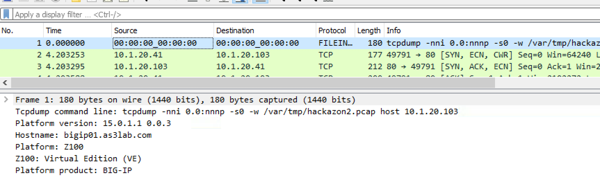
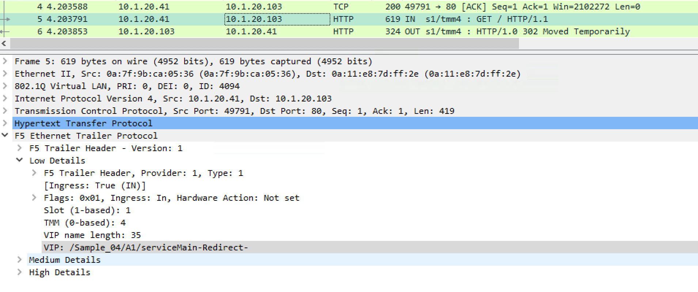

6. Configuring/Using Wireshark F5 Plugin
========================================

We will start with what kind of unique information is gathered through the plugin and using tcpdump on the F5.

6.1. Start by selecting packet 1 in Wireshark.

6.2. Notice in the middle section of wireshark you will see the tcpdump command being run.  You will also see the version of the F5 code, the F5 hostname, and the Platform ID number (in this case Z100 for Virtual Edition).  

6.3. Now we will use a wireshark display filter to see a specific request.  Add 'tcp.port == 80' in the display filter field and hit enter.

.. image:: ./_static/port80.png

6.4. In the capture above packet 7 shows the GET requests to the website.  In your capture it will be a different packet number but you can see in the Info area that it is a GET request.

6.5. Right click on the GET request and go to protocol preferences, and then populate fields for other dissectors.  

.. image:: ./_static/dissectors.png

6.6. Now notice in the middle section the F5 Ethernet trailer.  Expand this.

6.7. Then Expand F5 Low Details.

6.8. Notice the Ingress value is True (IN).  This is from the perspective of the F5.  The traffic is inbound to the F5.

6.9. The low details also give the Slot value (always be 1 for an appliance).  The TMM number in the image is 3.

6.10. The most important value here is the VIP.  In this case it is the /Common/hackazon.f5demo.com_http_vs.  Notice this is the port 80 VIP for this particular destination IP.  The VIP is configured with a redirect to SSL.

6.11. The next packet in the capture is a HTTP 302 redirect to the SSL vip.  
